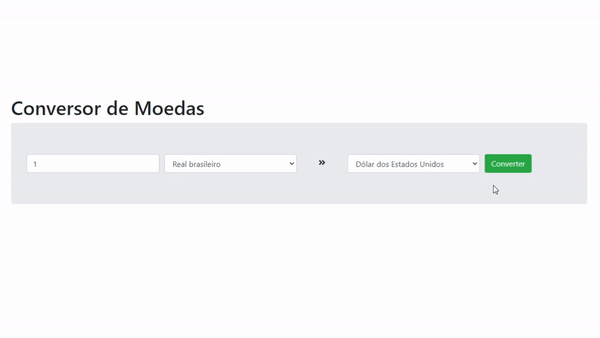

# Conversor de Moedas

## Dependências

1 - Bootstrap
2 - Axios
3 - Testing Library

## Scripts disponíveis

### `yarn start`

Inicializa a aplicação.\
Abra [http://localhost:3000](http://localhost:3000) para ver no navegador.

### `yarn test`

Executa testes em relação a conversão das moedas.
