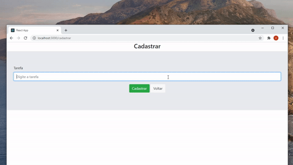

# Gerenciador de Tarefas

## Scripts disponíveis

### `npm start`

Inicializa a aplicação.\
Abra [http://localhost:3000](http://localhost:3000) para ver no navegador.

### `npm test`

Executa testes em relação a conversão das moedas.
